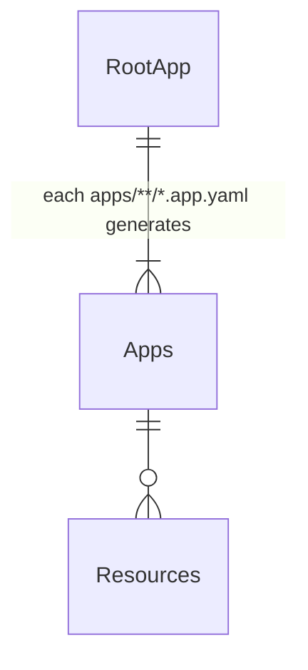
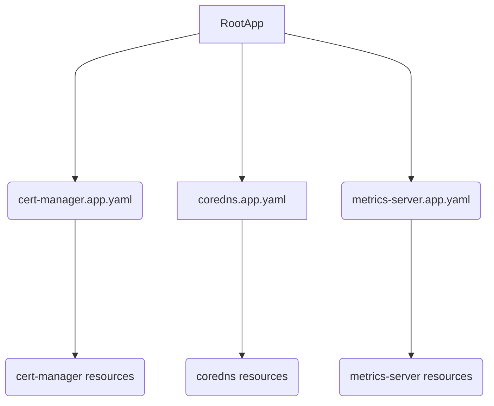

# Homelab

GitOps/IaC managed homelab using proxmox and ArgoCD

## Repo Structure

```
├── ansible                 # Ansible playbooks to configure vms
│   ├── inventory
│   ├── playbooks
│   └── roles
├── kubernetes              # ArgoCD configurations for clusters
│   ├── k3s                 # The main k3s cluster
│   │   ├── apps            # The definition of all services deployed in the custer
│   │   └── bootstrap       # Initial bootstrapping config
│   │       ├── ArgoCD      # ArgoCD helm chart 
│   │       ├── manifests   # One of mainfests e.g. ArgoCD app of apps
│   │       └── sops        # Any secrets that cannot be pulled from 1password (i.e. the 1password auth tokens used by ESO)
│   ├── mango               # Talos cluster used for testing
│   │   ├── apps
│   │   └── bootstrap
│   │       ├── argo
│   │       ├── manifests
│   │       └── sops
├── renovate.json           
├── scripts
├── terraform               # Terraform config
│   ├── infra               # Provisions VMs in proxmox
│       ├── talos           # Configures an talos vm
│       └── vm              # VM module
│   └── post                # Provisions/configures the infra (e.g. minio buckets/iam, DNS config)
│       ├── adguard         # Configures an adguard instance
│       └── bucket          # Minio bucket module
```

## ArgoCD Structure

Apps are deployed using the app-of-apps pattern, which pulls in any file with the `.app.yaml` suffix in the cluster directory `kubernetes/{cluster}/apps`

<table>
<tr>
<td>Logical</td>
<td>Rendered</td>
</tr>
<tr>
<td>



</td>
<td>



</td>
</tr>
</table>
